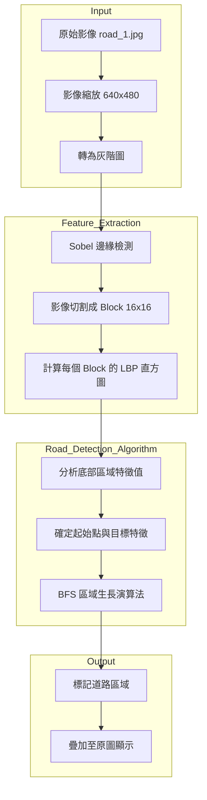
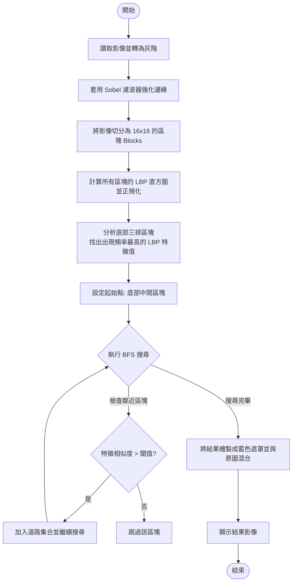

# HW-2-Road-Detection
這份程式碼 `test4.py` 主要是利用 **LBP (Local Binary Patterns, 局部二值模式)** 特徵結合 **BFS (廣度優先搜尋)** 演算法來進行道路偵測。

以下是針對此程式碼產生的架構圖、流程圖以及 API 說明：

### 1. 系統架構圖 (Architecture Diagram)

此架構展示了影像資料如何經過預處理、特徵提取，最後透過演算法產出偵測結果。

---

### 2. 程式流程圖 (Flowchart)

詳細描述 `main` 函式執行的邏輯步驟。

---

### 3. API 接口說明

根據 `test4.py` 中的函式定義，以下是主要的 API 說明：

#### `to_blocks(img, block_size)`
*   **功能**: 將二維影像陣列切分成指定大小的區塊。
*   **參數**:
    *   `img` (np.ndarray): 輸入的灰階影像。
    *   `block_size` (int): 區塊邊長（例如 16）。
*   **回傳**: 四維陣列 `(n_blocks_height, n_blocks_width, block_size, block_size)`。

#### `manual_lbp(block)`
*   **功能**: 對單一區塊計算 LBP 特徵值。
*   **參數**:
    *   `block` (np.ndarray): 16x16 的影像區塊。
*   **說明**: 遍歷像素點，將其與周圍 8 個像素比較，產生 8 位元的二進制字串並轉為整數 (0-255)。

#### `blocks_to_hist(blocks)`
*   **功能**: 計算所有區塊的 LBP 直方圖。
*   **參數**:
    *   `blocks` (np.ndarray): 切分好的區塊陣列。
*   **回傳**: 三維陣列 `(y, x, 256)`，代表每個區塊的 256 維直方圖（已正規化）。

#### `bfs_with_feature(_x, _y, _hist, target_feature, similarity)`
*   **功能**: 使用廣度優先搜尋 (BFS) 尋找具有相似特徵的相連區塊（道路區域）。
*   **參數**:
    *   `_x, _y`: 起始區塊座標。
    *   `_hist`: 區塊直方圖資料。
    *   `target_feature`: 要比對的目標 LBP 特徵索引。
    *   `similarity`: 相似度閾值係數（預設為 0.273）。
*   **回傳**: 包含所有屬於道路區塊座標的列表 `result`。

#### `display(img, cmap)`
*   **功能**: 使用 Matplotlib 顯示影像。
*   **參數**:
    *   `img`: 影像數據。
    *   `cmap`: 顏色映射（如 'gray'）。

---
### 實作特點總結
1.  **邊緣增強**: 在計算 LBP 前先做 Sobel，這代表偵測的是「紋理的變化強度」而非單純的顏色。
2.  **自我學習起始特徵**: 透過分析影像底部（通常是車頭前方最近的地面）來動態決定道路特徵，而非使用固定數值。
3.  **區域生長**: BFS 確保了偵測到的道路是連續的，有效過濾掉背景中具有相似紋理但非道路的雜訊。
---
### 舊版結果

### 新版結果

